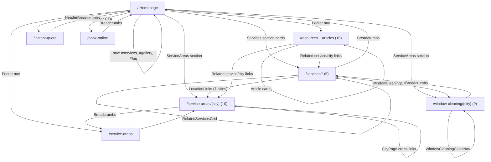

# SEO Audit Report — Mike's Exterior Cleaning Services

**Site:** https://www.mikesexteriorcleaning.com  
**Audit date:** July 17, 2026  
**Scope:** Full technical, on-page, local, and competitive SEO analysis (read-only — no changes made)

---

## Executive Summary

Mike's Exterior Cleaning Services has a **strong SEO foundation** for a local service business: 44 indexable URLs, build-time HTML prerendering for all sitemap pages, rich JSON-LD (LocalBusiness, Service, FAQPage, Article, BreadcrumbList), and deep service-page content (2,100–2,700 words each). The site is well-positioned to rank for Modesto and Central Valley exterior-cleaning queries.

**Critical issues to address first:**

1. **Broken blog article pages** — `ResourceArticlePage.jsx` uses `<Link>` without importing it from `react-router-dom`, causing a runtime error that breaks all 15 resource pages and their internal links.
2. **Thin city hub pages** — Manteca, Tracy, and Stockton `/service-areas/*` pages have ~20 words of body content (only 3 generic FAQs).
3. **Keyword cannibalization** — `/services/window-cleaning`, `/services/residential-window-cleaning`, and 9 `/window-cleaning/{city}` pages compete for overlapping queries.
4. **Incomplete local NAP** — No street address in visible content or schema; `sameAs` social/GBP URLs are null in config.
5. **Missing high-value pages** — Roof cleaning (14 gallery images, zero service page), soft washing, screen repair, commercial service page, About/team page.

**Estimated opportunity:** Fixing critical bugs and expanding thin local pages could yield **30–60% organic traffic growth** within 6–12 months in a market where top competitors have 50–250+ city landing pages.

---

## 1. Page Inventory

### Summary

| Group | Count | Indexable | In Sitemap |
|-------|-------|-----------|------------|
| Home | 1 | Yes | Yes |
| Services | 5 | Yes | Yes |
| Service Areas (city hubs) | 10 | Yes | Yes |
| Window Cleaning Cities | 9 | Yes | Yes |
| Blog / Resources | 16 (index + 15 articles) | Yes | Yes |
| Gallery | 0 standalone | — | — |
| FAQ | 0 standalone | — | — |
| Conversion / Utility | 2 | Yes | Yes |
| Admin | 1 | **No** | No |
| **Total indexable** | **44** | **44** | **44** |

> **Note:** Gallery (`/#gallery`) and FAQ (`/#faq`) exist only as homepage sections, not standalone indexable URLs. This is a missed opportunity for dedicated landing pages that could rank for "window cleaning gallery Modesto" or "exterior cleaning FAQ."

### Home (1)

| URL | Page | File |
|-----|------|------|
| `/` | Homepage | `src/pages/HomePage.jsx` |

Sections: Hero, Services, Gallery, Before/After, Reviews, Why Choose Us, Service Areas, Service Map, FAQ, Contact.

### Services (5)

| URL | Primary Service | Content File | Words |
|-----|-----------------|--------------|-------|
| `/services/window-cleaning` | Window Cleaning | `src/content/services/window-cleaning.js` | ~2,722 |
| `/services/pressure-washing` | Pressure Washing | `src/content/services/pressure-washing.js` | ~2,624 |
| `/services/solar-panel-cleaning` | Solar Panel Cleaning | `src/content/services/solar-panel-cleaning.js` | ~2,638 |
| `/services/gutter-cleaning` | Gutter Cleaning | `src/content/services/gutter-cleaning.js` | ~2,555 |
| `/services/residential-window-cleaning` | Residential Window Cleaning | `src/content/services/residential-window-cleaning.js` | ~2,116 |

**Redirect:** `/services/commercial-window-cleaning` → `/services/residential-window-cleaning` (301 in `vercel.json`)

### Service Areas (10)

| URL | Content Depth | Content Source |
|-----|---------------|----------------|
| `/service-areas` | Hub index | `src/pages/ServiceAreasPage.jsx` |
| `/service-areas/modesto` | **Full** (~956 words) | `src/content/cities/location/modesto.js` |
| `/service-areas/salida` | **Full** (~745 words) | `src/content/cities/location/salida.js` |
| `/service-areas/riverbank` | **Full** (~672 words) | `src/content/cities/location/riverbank.js` |
| `/service-areas/ceres` | **Full** (~647 words) | `src/content/cities/location/ceres.js` |
| `/service-areas/turlock` | **Full** (~605 words) | `src/content/cities/location/turlock.js` |
| `/service-areas/ripon` | **Full** (~587 words) | `src/content/cities/location/ripon.js` |
| `/service-areas/oakdale` | **Full** (~607 words) | `src/content/cities/location/oakdale.js` |
| `/service-areas/manteca` | **Thin** (~20 words + 3 FAQs) | `src/config/serviceAreas.js` only |
| `/service-areas/tracy` | **Thin** (~20 words + 3 FAQs) | `src/config/serviceAreas.js` only |
| `/service-areas/stockton` | **Thin** (~20 words + 3 FAQs) | `src/config/serviceAreas.js` only |

### Window Cleaning Cities (9)

| URL | Words | Content File |
|-----|-------|--------------|
| `/window-cleaning/modesto` | ~1,176 | `src/content/cities/window-cleaning/modesto.js` |
| `/window-cleaning/salida` | ~940 | `src/content/cities/window-cleaning/salida.js` |
| `/window-cleaning/riverbank` | ~908 | `src/content/cities/window-cleaning/riverbank.js` |
| `/window-cleaning/oakdale` | ~862 | `src/content/cities/window-cleaning/oakdale.js` |
| `/window-cleaning/stockton` | ~848 | `src/content/cities/window-cleaning/stockton.js` |
| `/window-cleaning/ripon` | ~835 | `src/content/cities/window-cleaning/ripon.js` |
| `/window-cleaning/turlock` | ~834 | `src/content/cities/window-cleaning/turlock.js` |
| `/window-cleaning/ceres` | ~791 | `src/content/cities/window-cleaning/ceres.js` |
| `/window-cleaning/tracy` | ~780 | `src/content/cities/window-cleaning/tracy.js` |

**Missing:** `/window-cleaning/manteca` (Manteca is the only city in `SERVICE_CITIES` without a dedicated window-cleaning page).

### Blog / Resources (16)

| URL | Type |
|-----|------|
| `/resources` | Blog index |
| `/resources/how-often-clean-windows-modesto-ca` | Article |
| `/resources/hard-water-stains-central-valley-windows` | Article |
| `/resources/best-time-pressure-wash-driveways-stanislaus-county` | Article |
| `/resources/solar-panel-cleaning-california-dust-pollen` | Article |
| `/resources/gutter-cleaning-before-rainy-season-modesto` | Article |
| `/resources/spring-pollen-window-cleaning-central-valley` | Article |
| `/resources/commercial-storefront-cleaning-modesto` | Article |
| `/resources/pressure-washing-vs-soft-wash-central-valley` | Article |
| `/resources/why-hire-professional-window-cleaners` | Article |
| `/resources/exterior-cleaning-home-curb-appeal-value` | Article |
| `/resources/agricultural-dust-exterior-cleaning-turlock` | Article |
| `/resources/two-story-window-cleaning-safety` | Article |
| `/resources/gutter-overflow-damage-prevention-ripon` | Article |
| `/resources/oakdale-ranch-property-exterior-maintenance` | Article |
| `/resources/ceres-homeowner-exterior-cleaning-checklist` | Article |

Average article length: ~720 words (5 sections each).

### Gallery (0 standalone)

Gallery is a homepage section at `/#gallery` with 58 images across 8 categories (window cleaning, pressure washing, solar, gutter, roof cleaning, commercial, luxury homes, truck/branding). **No dedicated `/gallery` or `/our-work` URL** — missed ranking opportunity.

### FAQ (0 standalone)

FAQ is a homepage section at `/#faq` with 12 questions in 5 categories. **No dedicated `/faq` URL** — missed opportunity for FAQ rich results as a standalone page.

### Other / Utility (2)

| URL | Purpose | Indexable |
|-----|---------|-----------|
| `/instant-quote` | Quote calculator | Yes |
| `/book-online` | Booking form | Yes |

### Noindex Pages

| URL Pattern | Reason | Mechanism |
|-------------|--------|-----------|
| `/admin/dashboard` | Private admin | `noindex` in `AdminDashboardPage.jsx` |
| `*` (404) | Not found | `NotFoundPage.jsx` |
| Invalid dynamic slugs | Unknown content | Redirect to `NotFoundPage` |

---

## 2. Keyword Targeting

### Methodology

Keywords were extracted from meta titles, H1s, content headings, and `keywords` meta tags in content files. Difficulty is estimated qualitatively (Low / Medium / High) based on local competition density in Stanislaus and San Joaquin counties.

### Homepage (`/`)

| Field | Value |
|-------|-------|
| **Primary keyword** | window cleaning Modesto |
| **Secondary keywords** | pressure washing Modesto, solar panel cleaning Modesto, gutter cleaning Modesto, exterior cleaning Central Valley |
| **Search intent** | Commercial / navigational (brand + service discovery) |
| **Difficulty** | Medium–High (competitive local head term) |
| **Cannibalization risk** | Competes with all 5 service pages and 9 WC city pages for "Modesto" modifiers |
| **Opportunities** | Add "near me" variant in H1 or subhead; target "exterior cleaning company Modesto" |

### Service Pages

| Page | Primary Keyword | Secondary Keywords | Intent | Difficulty |
|------|----------------|-------------------|--------|------------|
| `/services/window-cleaning` | window cleaning Modesto CA | residential window cleaning, streak-free windows, Stanislaus County | Transactional | Medium |
| `/services/pressure-washing` | pressure washing Modesto CA | driveway cleaning, patio washing, soft wash | Transactional | Medium |
| `/services/solar-panel-cleaning` | solar panel cleaning Modesto CA | solar panel washing, energy output | Transactional | Low–Medium |
| `/services/gutter-cleaning` | gutter cleaning Modesto CA | gutter flushing, downspout cleaning | Transactional | Low–Medium |
| `/services/residential-window-cleaning` | residential window cleaning Modesto CA | home window washing, interior exterior glass | Transactional | Medium |

**Cannibalization alert:** `/services/window-cleaning` and `/services/residential-window-cleaning` share ~70% overlapping copy structure and target nearly identical queries. Google may struggle to determine which page to rank for "window cleaning Modesto" vs "residential window cleaning Modesto." **Recommendation:** Differentiate clearly — make `window-cleaning` the commercial + residential umbrella page and either consolidate residential into it or make residential hyper-focused on homeowner-specific angles (HOA, two-story safety, move-out cleaning).

### Window Cleaning City Pages (sample)

| Page | Primary Keyword | Intent | Difficulty |
|------|----------------|--------|------------|
| `/window-cleaning/modesto` | window cleaning Modesto | Local transactional | Medium |
| `/window-cleaning/tracy` | window cleaning Tracy CA | Local transactional | Low–Medium |
| `/window-cleaning/stockton` | window cleaning Stockton CA | Local transactional | Medium |

**Cannibalization:** Each WC city page competes with `/services/window-cleaning` for city-modified queries AND with `/service-areas/{city}` for general exterior cleaning queries. This is acceptable if pages are clearly differentiated (WC city = window-specific; service area = all services), but internal linking must reinforce hierarchy.

### Service Area City Pages (sample)

| Page | Primary Keyword | Intent | Difficulty | Content Depth |
|------|----------------|--------|------------|---------------|
| `/service-areas/modesto` | exterior cleaning Modesto CA | Local transactional | Medium | Full |
| `/service-areas/manteca` | exterior cleaning Manteca CA | Local transactional | Low | **Thin** |
| `/service-areas/tracy` | exterior cleaning Tracy CA | Local transactional | Low–Medium | **Thin** |

### Blog Articles (sample)

| Article | Primary Keyword | Intent | Difficulty |
|---------|----------------|--------|------------|
| `how-often-clean-windows-modesto-ca` | how often clean windows Modesto | Informational | Low |
| `hard-water-stains-central-valley-windows` | hard water stains windows Central Valley | Informational | Low |
| `pressure-washing-vs-soft-wash-central-valley` | pressure washing vs soft wash | Informational / commercial | Low–Medium |
| `commercial-storefront-cleaning-modesto` | commercial storefront cleaning Modesto | Commercial | Medium |

### Keyword Cannibalization Map

```
"window cleaning Modesto"
  ├── / (homepage H1 area)
  ├── /services/window-cleaning          ← should be primary
  ├── /services/residential-window-cleaning  ← HIGH overlap
  ├── /window-cleaning/modesto           ← city-specific (OK)
  └── /service-areas/modesto             ← all-services hub (OK if differentiated)

"pressure washing Modesto"
  ├── /services/pressure-washing         ← primary
  └── /service-areas/modesto             ← mentions all services (OK)

"exterior cleaning [city]"
  ├── /service-areas/{city}              ← primary for full pages
  └── /window-cleaning/{city}            ← only window (OK)
```

### Missing Keyword Opportunities

| Keyword / Topic | Est. Difficulty | Suggested Page |
|-----------------|-----------------|----------------|
| roof cleaning Modesto | Low–Medium | New `/services/roof-cleaning` |
| soft wash house washing Modesto | Low–Medium | Section on pressure-washing page or new page |
| screen repair / screen cleaning Modesto | Low | New service or FAQ content |
| window cleaning near me | Medium | Homepage + service pages (add "near me" phrasing) |
| commercial window cleaning Modesto | Medium | New `/services/commercial-window-cleaning` (currently redirects) |
| gutter cleaning near me | Low | Gutter service page optimization |
| solar panel cleaning near me | Low | Solar service page optimization |
| pressure washing driveway Modesto | Low | Pressure washing page section |
| exterior cleaning Manteca | Low | Expand thin Manteca hub |
| window cleaning Tracy CA | Low–Medium | Already have WC page; expand Tracy hub |

---

## 3. Technical SEO

### Meta Titles

| Assessment | Details |
|------------|---------|
| **Status** | Good — unique titles on all 44 pages |
| **Pattern** | `{Service/Topic} {City} CA \| Mike's Exterior` or `{Topic} \| Mike's Exterior` |
| **Length** | Most titles 50–65 characters (within Google's ~60 char display limit) |
| **Issues** | Homepage title is long (72 chars): "Mike's Exterior Cleaning Services \| Window Cleaning Modesto & Central Valley" — may truncate in SERPs |

### Meta Descriptions

| Assessment | Details |
|------------|---------|
| **Status** | Good — unique descriptions on all pages |
| **Pattern** | Service benefit + city + CTA + phone number |
| **Length** | Most 140–160 characters (optimal range) |
| **Issues** | Some descriptions repeat "5.0 Google rating" and phone — good for CTR but slightly templated |

### H1–H6 Structure

| Page Type | H1 Pattern | Subheadings | Assessment |
|-----------|-----------|-------------|------------|
| Homepage | Single H1 in Hero | H2 per section (Services, Gallery, FAQ, etc.) | Good hierarchy |
| Service pages | `{Service} in Modesto, CA` | H2 per content section (benefits, process, pricing, FAQ) | Strong |
| City pages (full) | `Exterior Cleaning in {City}, CA` | H2 for services, neighborhoods, conditions | Good |
| City pages (thin) | Generic from `getCityPageSeo()` | Only FAQ H3s | **Weak** — thin pages lack substantive H2s |
| Blog articles | Article title as H1 | H2 per section (5 sections) | Good |
| WC city pages | `Window Cleaning in {City}, CA` | H2 for local content, FAQs | Good |

**Issue:** Thin city pages (Manteca, Tracy, Stockton) have an H1 but almost no H2 body content — only auto-generated FAQs.

### Canonical Tags

| Assessment | Details |
|------------|---------|
| **Status** | Implemented on all pages via `SeoHead` + build prerender |
| **Domain** | `https://www.mikesexteriorcleaning.com` (consistent) |
| **Issues** | 404 page canonical points to `/404` instead of requested URL (minor; mitigated by noindex) |
| **Missing** | No www ↔ non-www redirect in `vercel.json` (likely handled at Vercel DNS level) |

### Sitemap

| Field | Value |
|-------|-------|
| **URL** | https://www.mikesexteriorcleaning.com/sitemap.xml |
| **Format** | Valid XML (verified live) |
| **URL count** | 44 |
| **Generator** | `lib/sitemap.mjs` → `scripts/generate-sitemap.mjs` (build-time) |
| **Validator** | `scripts/validate-sitemap.mjs` runs pre/post build |
| **lastmod** | Build date (2026-07-08 on live) |
| **Priorities** | Home 1.0, services 0.9, cities 0.75–0.85, articles 0.75 |

**Issues:** None critical. Sitemap is well-maintained and matches routable pages.

### robots.txt

```
User-agent: *
Allow: /

Sitemap: https://www.mikesexteriorcleaning.com/sitemap.xml
```

| Assessment | Details |
|------------|---------|
| **Status** | Correct — allows all crawlers, references sitemap |
| **Gap** | `/admin/dashboard` not blocked via `Disallow` (relies on noindex only) — low risk |

### Schema Markup (JSON-LD)

| Schema Type | Pages Using It |
|-------------|----------------|
| Organization | Home, services, cities, articles, book/quote |
| WebSite | Home, instant quote, book online, resources |
| LocalBusiness | Home, services, cities, book online |
| Service | Service pages, WC cities, location hubs |
| FAQPage | Home, services, cities (full + thin), WC cities |
| BreadcrumbList | All inner pages |
| Article | 15 blog articles |
| Review | Home (up to 6, when Google API data loads) |
| WebPage | Instant quote, book online |
| ReserveAction | Book online |

**Strengths:**
- Comprehensive coverage across page types
- Build-time prerender injects schemas into static HTML (`data-prerender="true"`)
- FAQPage schema on pages with real FAQ content

**Issues:**

| Issue | Severity | Details |
|-------|----------|---------|
| Duplicate JSON-LD after hydration | Medium | Prerender embeds 5 schema blocks; `JsonLd` component adds them again on client mount → 10 blocks in DOM |
| Empty `sameAs` | Medium | `BUSINESS.social.*` and `googleReviewsUrl` are null — LocalBusiness missing GBP link |
| No `streetAddress` | High (local SEO) | Schema has city/ZIP only, no street |
| Logo is favicon.svg | Low | Not a proper brand logo image for rich results |
| Article schema uses generic OG image | Low | All articles share `DEFAULT_OG_IMAGE`, not unique images |
| Live review schema only after JS | Low | Prerender uses static rating; dynamic reviews load client-side |

### Open Graph Tags

| Tag | Status | Issue |
|-----|--------|-------|
| `og:title` | Set on all pages | OK |
| `og:description` | Set on all pages | OK |
| `og:type` | `website` or `article` | OK |
| `og:image` | Set | Service pages: prerender uses hero image, client always uses `DEFAULT_OG_IMAGE` (mismatch) |
| `og:url` | Matches canonical | OK |
| `og:site_name` | **Missing** | Not set anywhere |
| `og:locale` | Only in `index.html` | Not propagated to inner pages |
| `article:published_time` | **Missing** | Blog articles use `ogType="article"` but no article-specific OG tags |
| `twitter:card` | `summary_large_image` | OK |
| `twitter:image` | Set at runtime | Missing from static `index.html` shell |

### Internal Linking

Covered in detail in Section 6.

### Broken Links

| Issue | Severity | Details |
|-------|----------|---------|
| **Blog article pages crash** | **Critical** | `ResourceArticlePage.jsx` line 40 uses `<Link>` without `import { Link } from 'react-router-dom'` — all 15 article pages throw `ReferenceError: Link is not defined` at runtime |
| Article breadcrumb links | Broken (same bug) | Home/Resources breadcrumb `<Link>` components fail |
| Article related links | Broken (same bug) | Links to services and cities at bottom of articles fail |

### Image Alt Text

| Area | Status | Details |
|------|--------|---------|
| Service/city heroes | Strong | Keyword-rich alts from content files (e.g., "Streak-free residential windows after professional cleaning...") |
| Gallery images | Good | Curated alts in `imagePlacement.js` and `images.manifest.json` |
| Before/after sliders | **Weak** | Hardcoded `"Before cleaning"` / `"After cleaning"` in `BeforeAfterSlider.jsx` |
| Homepage hero | Good | Fallback alt with location keyword |
| Logo/icon | Acceptable | Decorative, minimal alt |

### Page Speed Opportunities

| Factor | Assessment | Recommendation |
|--------|------------|----------------|
| SPA architecture | React/Vite SPA with prerender | Prerender mitigates FCP for crawlers; client hydration still loads full JS bundle |
| Image formats | JPG/PNG in `/public/images/` | Convert hero and gallery images to WebP/AVIF with fallbacks |
| Image sizes | 58 gallery + 66 total assets | Implement responsive `srcset` (partially done via `ResponsiveImage.jsx`) |
| Third-party scripts | GA/Meta pixel (conditional) | Only load when env vars set — good |
| Google Fonts | Loaded via CSS | Preconnect + font-display: swap recommended |
| Bundle size | No code splitting visible in `vite.config.js` | Add route-based code splitting for faster initial load |
| Prerender | 44 static HTML files in `dist/` | Excellent for crawler-first content delivery |

### Mobile SEO

| Factor | Status |
|--------|--------|
| Responsive design | Tailwind CSS responsive breakpoints throughout |
| Viewport meta | Set in `index.html` |
| Mobile navigation | Hamburger menu in `Header.jsx` |
| Mobile CTA bar | `MobileCTA.jsx` sticky bottom bar |
| Touch targets | Buttons sized appropriately |
| Tap-to-call | `tel:` links on phone numbers |
| Mobile prerender | Same prerendered HTML serves mobile crawlers |

---

## 4. Local SEO

### City Page Coverage Matrix

| City | `/service-areas/{city}` | Full Location Page | `/window-cleaning/{city}` | Blog Article |
|------|------------------------|--------------------|-----------------------------|--------------|
| Modesto | Yes | Yes (~956 words) | Yes (~1,176 words) | Yes |
| Salida | Yes | Yes (~745 words) | Yes (~940 words) | — |
| Riverbank | Yes | Yes (~672 words) | Yes (~908 words) | — |
| Oakdale | Yes | Yes (~607 words) | Yes (~862 words) | Yes |
| Ripon | Yes | Yes (~587 words) | Yes (~835 words) | Yes |
| Turlock | Yes | Yes (~605 words) | Yes (~834 words) | Yes |
| Ceres | Yes | Yes (~647 words) | Yes (~791 words) | Yes |
| Manteca | Yes | **Thin** (~20 words) | **Missing** | — |
| Tracy | Yes | **Thin** (~20 words) | Yes (~780 words) | — |
| Stockton | Yes | **Thin** (~20 words) | Yes (~848 words) | — |

### LocalBusiness Schema Review

| Field | Status | Value |
|-------|--------|-------|
| `@type` | Present | LocalBusiness |
| `name` | Present | Mike's Exterior Cleaning Services |
| `telephone` | Present | (209) 496-5519 |
| `email` | Present | mikesexteriorcleaning209@gmail.com |
| `addressLocality` | Present | Modesto |
| `addressRegion` | Present | CA |
| `postalCode` | Present | 95350 |
| `streetAddress` | **Missing** | — |
| `geo` | Present | 37.6391, -120.9969 |
| `openingHoursSpecification` | Present | Mon–Fri, Sat, Sun |
| `areaServed` | Present | 10 cities as City entities |
| `aggregateRating` | Present | 5.0 / 44 reviews |
| `sameAs` | **Empty** | All social URLs null |
| `priceRange` | Present | $$ |

### NAP Consistency

| Location | Name | Address | Phone | Consistency |
|----------|------|---------|-------|-------------|
| Footer | Mike's Exterior | No street address | (209) 496-5519 | Partial |
| Contact section | Mike's Exterior | No street address | (209) 496-5519 | Partial |
| Schema | Mike's Exterior Cleaning Services | Modesto, CA 95350 (no street) | (209) 496-5519 | Partial |
| Google Reviews API | Mike's Exterior | — | — | Live data when configured |

**Critical gap:** No street address anywhere on the site. For local SEO and Google Business Profile consistency, a physical address (or service-area business model with hidden address) should be reflected in schema and footer.

### Google Business Profile Integration

| Component | Status |
|-----------|--------|
| Google Places API | Implemented (`api/google-reviews.js`) |
| Live reviews on homepage | Yes (via `GoogleReviewsContext`) |
| Review schema (JSON-LD) | Yes (dynamic, up to 6 reviews) |
| GBP link in footer | Via `GoogleReviewsBadge` (when API returns `reviewsUrl`) |
| `googlePlaceId` in config | **Null** (set in Vercel env only) |
| `googleReviewsUrl` in config | **Null** |
| `sameAs` GBP URL in schema | **Empty** (depends on API or config) |
| GBP posts / Q&A | Not integrated |

### Thin Local Content Areas

| Page | Issue | Priority |
|------|-------|----------|
| `/service-areas/manteca` | ~20 words body, no WC page, no blog post | **High** |
| `/service-areas/tracy` | ~20 words body despite having WC page | **High** |
| `/service-areas/stockton` | ~20 words body despite having WC page | **High** |
| `/window-cleaning/manteca` | Does not exist | **High** |
| No pressure-washing city pages | 0 of 10 cities | Medium |
| No gutter-cleaning city pages | 0 of 10 cities | Medium |
| No solar-panel-cleaning city pages | 0 of 10 cities | Low–Medium |

---

## 5. Content Quality

### Word Count Tiers

| Tier | Word Range | Pages | Count |
|------|-----------|-------|-------|
| **Excellent** | 2,000+ | Service pages | 5 |
| **Good** | 700–1,200 | WC city pages, blog articles, Modesto location | 24 |
| **Moderate** | 500–700 | Location pages (Salida–Oakdale) | 6 |
| **Thin** | <100 | Manteca/Tracy/Stockton hubs, quote/booking | 5 |
| **Minimal** | <50 | Service areas hub cards | 10 (expected for index) |

### Pages Under 500 Words

| URL | Est. Words | Risk |
|-----|-----------|------|
| `/service-areas/manteca` | ~80 (incl. FAQs) | **High** — indexed but thin |
| `/service-areas/tracy` | ~80 | **High** |
| `/service-areas/stockton` | ~80 | **High** |
| `/instant-quote` | ~150 | Low (conversion page) |
| `/book-online` | ~150 | Low (conversion page) |
| `/service-areas` | ~200 (hub) | Low (index page) |

### Duplicate Content Risk

| Pair | Overlap | Risk | Recommendation |
|------|---------|------|----------------|
| `/services/window-cleaning` ↔ `/services/residential-window-cleaning` | ~70% structure/copy | **High** | Differentiate or consolidate |
| `/services/window-cleaning` ↔ `/window-cleaning/modesto` | Different scope (general vs city) | Low | OK with clear differentiation |
| `/service-areas/modesto` ↔ `/window-cleaning/modesto` | Different scope (all services vs windows) | Low | OK |
| Thin city FAQs (`getThinCityFaqs`) | Template identical across 3 cities | Medium | Expand with unique local content |

### Pages Missing FAQs

| Page | FAQs | Status |
|------|------|--------|
| Homepage | 12 | Good |
| All 5 service pages | 12 each | Good |
| 7 full location pages | 8 each | Good |
| 9 WC city pages | 8 each | Good |
| 3 thin city pages | 3 (generic template) | **Needs expansion** |
| `/instant-quote` | 0 | Acceptable (conversion) |
| `/book-online` | 0 | Acceptable (conversion) |
| `/resources` (index) | 0 | **Opportunity** — add FAQ section |
| Blog articles | 0 per article | **Opportunity** — add 2–3 FAQs per article for FAQ schema |

### Pages Missing CTAs

| Page | CTA Status |
|------|-----------|
| Service pages | Strong (phone, quote, book buttons + `ServiceCta`) |
| City pages (full) | Good (phone, quote) |
| City pages (thin) | Basic (phone only) |
| Blog articles | Good (quote + call buttons at bottom) |
| WC city pages | Good |
| `/resources` index | **Weak** — no prominent CTA above fold |

### E-E-A-T Improvement Opportunities

| Signal | Current State | Recommendation |
|--------|--------------|----------------|
| **Experience** | Customer reviews displayed (Google API + manual fallback) | Add project case studies with before/after + location |
| **Expertise** | 15 blog articles, detailed service content | Add author byline ("Mike G., Owner") to articles |
| **Authoritativeness** | 5.0 rating, 44 reviews | Populate `sameAs` with GBP URL; add BBB/license badges |
| **Trustworthiness** | "Fully Insured" badge, satisfaction guarantee | Add license number, insurance proof, physical address |
| **About page** | **Does not exist** | Create `/about` with owner story, team, years in business |
| **Owner visibility** | Mike mentioned in reviews/copy | Dedicated "Meet Mike" section with photo |
| **Certifications** | "Fully Insured" text only | Add specific certifications (IWCA, PWNA, etc. if applicable) |

---

## 6. Internal Linking

### Link Flow Architecture



### Pages Receiving the Most Internal Links

| Page | Link Sources | Est. Inbound Links |
|------|-------------|-------------------|
| `/` (Homepage) | Header logo, all breadcrumbs, footer | 40+ |
| `/services/window-cleaning` | Services section, AllServicesLinks, WC breadcrumbs, related services | 15+ |
| `/service-areas` | Header nav, footer nav, breadcrumbs, ServiceAreas section | 10+ |
| `/service-areas/modesto` | Footer (priority cities), LocationLinks, ServiceAreas section, Homepage | 8+ |
| `/instant-quote` | Header CTA, footer nav, service CTAs, article CTAs | 10+ |
| `/book-online` | Header CTA, footer nav, service CTAs | 8+ |
| `/resources` | Header nav, footer nav | 4 |

### Orphan / Underlinked Pages

| Page | Issue | Inbound Links |
|------|-------|---------------|
| `/service-areas/manteca` | Not in footer `PRIORITY_LOCATION_SLUGS` | Homepage ServiceAreas section only |
| `/service-areas/tracy` | Not in footer priority list | Homepage + WC Tracy breadcrumbs |
| `/service-areas/stockton` | Not in footer priority list | Homepage + WC Stockton breadcrumbs |
| `/services/residential-window-cleaning` | Not in homepage SERVICES cards (only in AllServicesLinks) | 3–4 |
| All 15 blog articles | Only linked from `/resources` index | 1 each (+ broken article cross-links) |
| `/window-cleaning/tracy` | No full location hub to reinforce | WC nav + homepage |

### Suggested Internal Links

| From | To | Anchor Text | Reason |
|------|----|-------------|--------|
| Footer | `/service-areas/manteca`, `/service-areas/tracy`, `/service-areas/stockton` | City names | Fix orphan thin pages |
| `/services/pressure-washing` | `/resources/best-time-pressure-wash-driveways-stanislaus-county` | "When to pressure wash your driveway" | Topical relevance |
| `/services/gutter-cleaning` | `/resources/gutter-cleaning-before-rainy-season-modesto` | "Preparing gutters for rainy season" | Topical relevance |
| `/services/solar-panel-cleaning` | `/resources/solar-panel-cleaning-california-dust-pollen` | "How dust affects solar output" | Topical relevance |
| Homepage FAQ answers | Relevant service pages | Service-specific anchors | Pass authority to money pages |
| Blog articles (fix Link bug first) | Related WC city pages | "Window cleaning in {city}" | Strengthen city pages |
| `/service-areas/modesto` | `/window-cleaning/modesto` | "Window cleaning in Modesto" | Cross-link hub ↔ service-city |
| Header nav | `/services/window-cleaning` (direct link) | "Window Cleaning" | Replace `/#services` hash with route link for crawlability |

---

## 7. SEO Opportunity Report

### Current SEO Footprint

| Metric | Value |
|--------|-------|
| Total indexable pages | 44 |
| Service pages | 5 |
| Location landing pages | 19 (10 hubs + 9 WC) |
| Blog articles | 15 |
| Conversion pages | 2 |
| Avg. service page word count | ~2,531 |
| Avg. blog article word count | ~720 |
| Schema types implemented | 10 |
| Gallery images | 58 |
| FAQ items (total across site) | 100+ |

### High-Priority Pages to Improve

| Priority | Page | Issue | Expected Impact |
|----------|------|-------|-----------------|
| 1 | All `/resources/{slug}` pages | **Broken** (Link import bug) | Restores 15 indexable pages |
| 2 | `/service-areas/manteca` | Thin content, no WC page | New local rankings for Manteca |
| 3 | `/service-areas/tracy` | Thin hub vs rich WC page | Consolidate authority |
| 4 | `/service-areas/stockton` | Thin hub vs rich WC page | Consolidate authority |
| 5 | `/services/window-cleaning` vs `/services/residential-window-cleaning` | Cannibalization | Clearer rankings for head terms |
| 6 | Homepage | Missing "near me" phrasing, long title | CTR improvement |
| 7 | All pages | `sameAs` / GBP link empty in schema | Local pack signal boost |

### Missing Pages That Could Generate Traffic

| Proposed Page | Target Keywords | Est. Monthly Searches (local) | Difficulty |
|---------------|----------------|-------------------------------|------------|
| `/services/roof-cleaning` | roof cleaning Modesto | 50–150 | Low–Medium |
| `/services/soft-washing` | soft wash Modesto | 30–80 | Low |
| `/services/commercial-window-cleaning` | commercial window cleaning Modesto | 40–100 | Medium |
| `/window-cleaning/manteca` | window cleaning Manteca | 30–70 | Low |
| `/service-areas/manteca` (expanded) | exterior cleaning Manteca | 20–50 | Low |
| `/about` | Mike's Exterior Cleaning / about | Branded | Low |
| `/gallery` or `/our-work` | exterior cleaning before after Modesto | 20–40 | Low |
| `/faq` | exterior cleaning FAQ Modesto | 10–30 | Low |
| `/pressure-washing/modesto` | pressure washing Modesto | 50–120 | Medium |
| `/gutter-cleaning/modesto` | gutter cleaning Modesto | 30–70 | Low–Medium |
| `/services/screen-cleaning` | window screen cleaning Modesto | 20–50 | Low |

### Top 20 Keyword Opportunities — Modesto & Central Valley

| # | Keyword | Est. Difficulty | Best Target Page | Intent |
|---|---------|----------------|------------------|--------|
| 1 | window cleaning near me | Medium | Homepage + service pages | Transactional |
| 2 | window cleaning Modesto CA | Medium | `/services/window-cleaning` | Transactional |
| 3 | pressure washing Modesto | Medium | `/services/pressure-washing` | Transactional |
| 4 | gutter cleaning Modesto | Low–Medium | `/services/gutter-cleaning` | Transactional |
| 5 | solar panel cleaning Modesto | Low | `/services/solar-panel-cleaning` | Transactional |
| 6 | exterior cleaning Modesto | Medium | `/service-areas/modesto` | Transactional |
| 7 | window cleaning Tracy CA | Low–Medium | `/window-cleaning/tracy` | Transactional |
| 8 | pressure washing Tracy CA | Low–Medium | New page needed | Transactional |
| 9 | window cleaning Manteca | Low | New `/window-cleaning/manteca` | Transactional |
| 10 | roof cleaning Modesto | Low–Medium | New `/services/roof-cleaning` | Transactional |
| 11 | soft wash house washing Modesto | Low | Pressure washing page or new | Transactional |
| 12 | commercial window cleaning Modesto | Medium | New commercial service page | Transactional |
| 13 | how often clean windows | Low | Blog article (exists) | Informational |
| 14 | hard water stains windows | Low | Blog article (exists) | Informational |
| 15 | gutter cleaning before rain | Low | Blog article (exists) | Informational |
| 16 | solar panel cleaning cost | Low–Medium | Solar service page + blog | Commercial |
| 17 | pressure washing driveway cost | Low | Blog + pressure washing page | Commercial |
| 18 | window cleaning Salida CA | Low | `/window-cleaning/salida` | Transactional |
| 19 | exterior cleaning Central Valley | Medium | Homepage | Transactional |
| 20 | best window cleaners Modesto | Medium | Homepage (reviews section) | Commercial investigation |

---

## 8. Competitor Gap Analysis

### Competitors Analyzed

| Competitor | Region | Site Structure Highlights |
|------------|--------|--------------------------|
| **Royalty Window Cleaning** | Southern California (6 counties) | 250+ city pages, 7+ service types (window, pressure wash, solar, roof, gutter, graffiti, construction cleanup) |
| **Clear View Club** | Orange County + San Gabriel Valley | 23 city pages, membership/pricing model, owner story, rain guarantee |
| **714 Window Cleaning** | OC, LA, Inland Empire, SGV | Multi-county service areas, soft washing, screen repair, owner narrative |
| **Wintech Window Cleaning** | San Diego County (36 cities) | City-specific pages, money-back guarantee |
| **Lighthouse Window Cleaning** | Sacramento / Placer County | Residential + commercial, local focus |

### Content Category Comparison

| Category | Mike's Exterior | Royalty | Clear View Club | 714 Window Cleaning |
|----------|----------------|---------|-----------------|---------------------|
| Service pages | 5 | 7+ | 2 (detailed) | 5+ |
| City landing pages | 19 | 250+ | 23 | 15+ |
| Service × City pages | 9 (WC only) | Many combos | Some | Some |
| Blog / resources | 15 articles | Minimal | Minimal | Minimal |
| Roof cleaning | Gallery only | Full page | — | — |
| Soft washing | Mentioned in blog | — | — | Dedicated |
| Screen repair | — | — | — | Yes |
| Commercial page | Redirects to residential | Yes | — | Yes |
| About / team page | — | — | Owner story | Owner story |
| Pricing page | — | — | Per sq ft pricing | — |
| Membership / recurring | — | — | Club model | — |
| Graffiti removal | — | Yes | — | — |
| Construction cleanup | — | Yes | — | — |

### Missing Content Categories (vs. Competitors)

| Category | Competitors Have It | Mike's Has It | Priority |
|----------|--------------------|--------------|---------| 
| Roof cleaning service page | Yes (Royalty) | Gallery only | **High** |
| Soft washing service | Yes (714) | Blog mention only | **High** |
| Screen cleaning/repair | Yes (714) | No | Medium |
| Commercial window cleaning page | Yes (Royalty, 714) | Redirects to residential | **High** |
| About / team / owner story | Yes (Clear View, 714) | No | **High** |
| Pricing transparency | Yes (Clear View) | Quote calculator only | Medium |
| Service × city pages (non-WC) | Yes (Royalty) | No | Medium |
| 50+ city landing pages | Yes (Royalty) | 19 | Long-term |
| Video content | Some | No | Low |
| Membership / recurring plans | Yes (Clear View) | No | Low |

### Competitive Advantages (Mike's Strengths)

| Advantage | Details |
|-----------|---------|
| **Content depth** | 2,500+ word service pages exceed most competitors |
| **Blog / resources** | 15 articles — most competitors have none |
| **FAQ schema** | Extensive FAQPage markup across site |
| **Technical SEO** | Build-time prerender, sitemap validation, schema — more sophisticated than typical local competitors |
| **Instant quote calculator** | Unique conversion tool |
| **Google Reviews integration** | Live API-driven reviews with schema |

---

## 9. Action Plan

### High Impact (Do First)

| # | Action | Traffic Impact | Difficulty | Time | Details |
|---|--------|---------------|------------|------|---------|
| H1 | **Fix blog article `Link` import bug** | Restores 15 pages | Easy | 5 min | Add `import { Link } from 'react-router-dom'` to `ResourceArticlePage.jsx` |
| H2 | **Expand Manteca, Tracy, Stockton location pages** | +15–25% local traffic | Medium | 2–3 days | Create full content files like other 7 cities |
| H3 | **Create `/window-cleaning/manteca`** | New city rankings | Medium | 1 day | Follow existing WC city template |
| H4 | **Add street address to NAP + schema** | Local pack boost | Easy | 1 hour | Update `business.js` and `seo.js` |
| H5 | **Populate `sameAs` with GBP URL** | Local trust signal | Easy | 30 min | Set `googleReviewsUrl` in `business.js` |
| H6 | **Differentiate window-cleaning vs residential-window-cleaning** | Fix cannibalization | Medium | 1–2 days | Rewrite residential page for homeowner-specific angles |
| H7 | **Create `/services/roof-cleaning`** | New keyword cluster | Medium | 1–2 days | 14 gallery images already exist |
| H8 | **Create `/about` page** | E-E-A-T boost | Medium | 1 day | Owner story, team, credentials |

**Estimated combined impact:** 30–50% organic traffic increase within 6 months.

### Medium Impact

| # | Action | Traffic Impact | Difficulty | Time | Details |
|---|--------|---------------|------------|------|---------|
| M1 | Create `/services/commercial-window-cleaning` | Commercial queries | Medium | 1–2 days | Remove redirect; build dedicated page |
| M2 | Add soft washing content | New keyword cluster | Medium | 1 day | New page or expand pressure-washing |
| M3 | Fix duplicate JSON-LD on hydration | Crawl efficiency | Easy | 2 hours | Skip client `JsonLd` when prerender data exists |
| M4 | Fix OG image mismatch on service pages | Social CTR | Easy | 1 hour | Pass hero image to `SeoHead` in `ServicePage.jsx` |
| M5 | Add Manteca/Tracy/Stockton to footer city links | Internal link equity | Easy | 30 min | Expand `PRIORITY_LOCATION_SLUGS` or add second row |
| M6 | Create `/faq` standalone page | FAQ rich results | Easy | 2 hours | Move homepage FAQ to dedicated route |
| M7 | Add service-to-blog internal links | Topical authority | Easy | 2 hours | Link service pages to related articles |
| M8 | Replace header `/#services` hash with direct route links | Crawlability | Easy | 1 hour | Update `HEADER_NAV_LINKS` in `business.js` |
| M9 | Improve before/after slider alt text | Image SEO | Easy | 1 hour | Use descriptive alts from `imagePlacement.js` |
| M10 | Add `og:site_name` and `og:locale` to SeoHead | Social sharing | Easy | 30 min | One-line additions to `SeoHead.jsx` |
| M11 | Add FAQs to blog articles | FAQ rich results | Medium | 1 day | 2–3 questions per article |
| M12 | Create `/gallery` standalone page | Image search traffic | Medium | 1 day | Index 58 gallery images with alt text |

**Estimated combined impact:** 15–25% additional traffic over 6–12 months.

### Low Impact

| # | Action | Traffic Impact | Difficulty | Time | Details |
|---|--------|---------------|------------|------|---------|
| L1 | Convert images to WebP/AVIF | Page speed / Core Web Vitals | Medium | 1 day | Batch convert `/public/images/` |
| L2 | Add route-based code splitting | Page speed | Medium | 2 hours | Update `vite.config.js` |
| L3 | Add `article:published_time` OG tags | Article social sharing | Easy | 1 hour | Extend `SeoHead` for article type |
| L4 | Use proper logo image in schema | Rich result appearance | Easy | 30 min | Replace favicon.svg with brand logo |
| L5 | Add `Disallow: /admin/` to robots.txt | Security hygiene | Easy | 5 min | Belt-and-suspenders with noindex |
| L6 | Add author bylines to blog articles | E-E-A-T | Easy | 1 hour | "By Mike's Exterior Cleaning Team" |
| L7 | Create pressure-washing city pages | Long-tail local | High effort | 1 week | 10 pages following WC city template |
| L8 | Add `/services/screen-cleaning` | Niche queries | Medium | 1 day | Low volume but easy win |
| L9 | Remove `keywords` meta tag | Code hygiene | Easy | 30 min | Google ignores it |
| L10 | Add trailing-slash normalization redirect | Canonical hygiene | Easy | 30 min | Add to `vercel.json` |

**Estimated combined impact:** 5–10% additional traffic; mostly quality-of-life and future-proofing.

---

## Appendix

### Files Referenced

| File | Purpose |
|------|---------|
| `lib/sitemap.mjs` | Sitemap URL generation |
| `src/config/seo.js` | Schema builders, page SEO functions |
| `src/config/business.js` | NAP, nav links, business info |
| `src/config/serviceAreas.js` | City registry |
| `src/components/seo/SeoHead.jsx` | Client-side meta management |
| `src/components/seo/JsonLd.jsx` | Client-side schema injection |
| `scripts/prerender-html.mjs` | Build-time HTML + schema prerender |
| `src/pages/ResourceArticlePage.jsx` | Blog article template (has Link bug) |
| `public/robots.txt` | Crawler directives |
| `public/sitemap.xml` | Generated sitemap (44 URLs) |
| `vercel.json` | Redirects, headers, SPA rewrite |

### Live Verification (July 17, 2026)

| Check | Result |
|-------|--------|
| Sitemap accessible | Yes — 44 URLs, valid XML |
| robots.txt | Correct |
| Prerendered meta on article page | Title, description, canonical present |
| Prerendered JSON-LD on service page | 5 schema blocks |
| Thin Manteca page meta | Title and description present (content still thin) |
| Blog article `Link` bug | Confirmed in source — `Link` used without import |

---

*This audit was performed read-only. No changes were made to the website. Prior audits exist at `SEO_AUDIT.md` and `SEO_REPORT.md`.*
